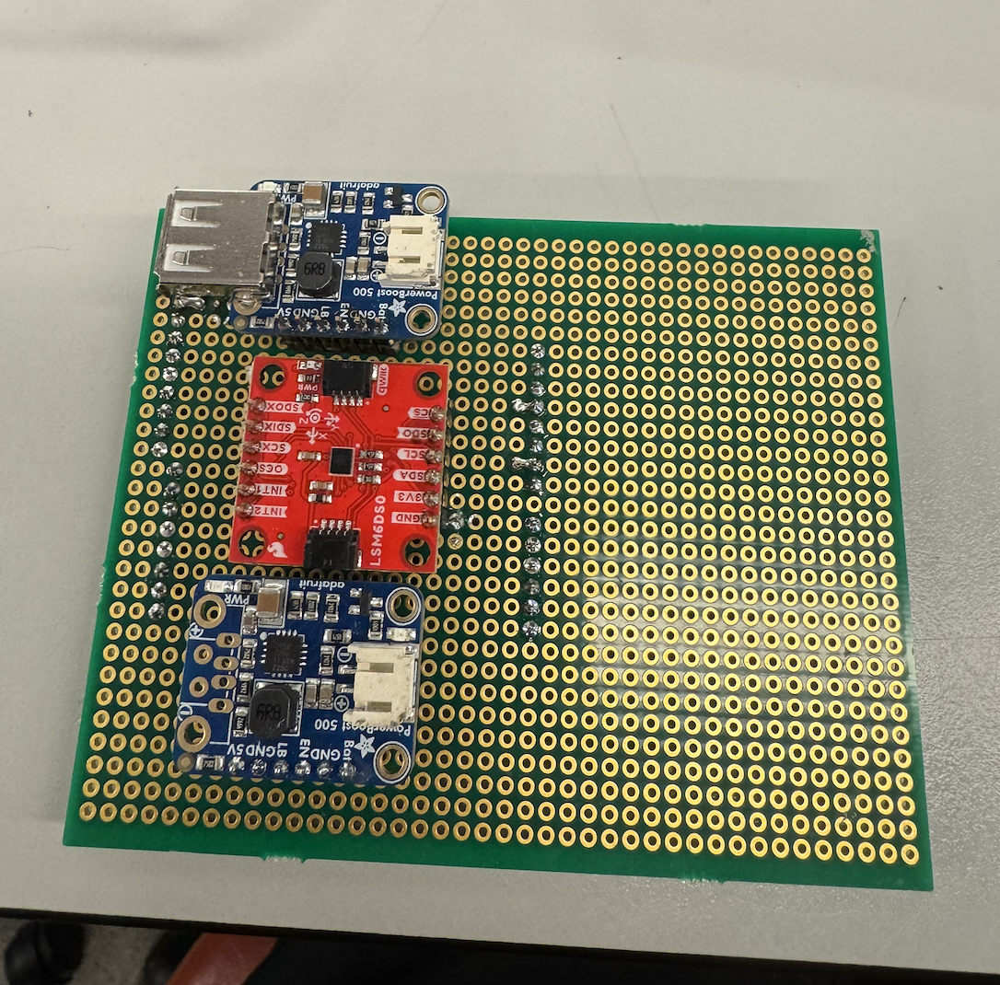
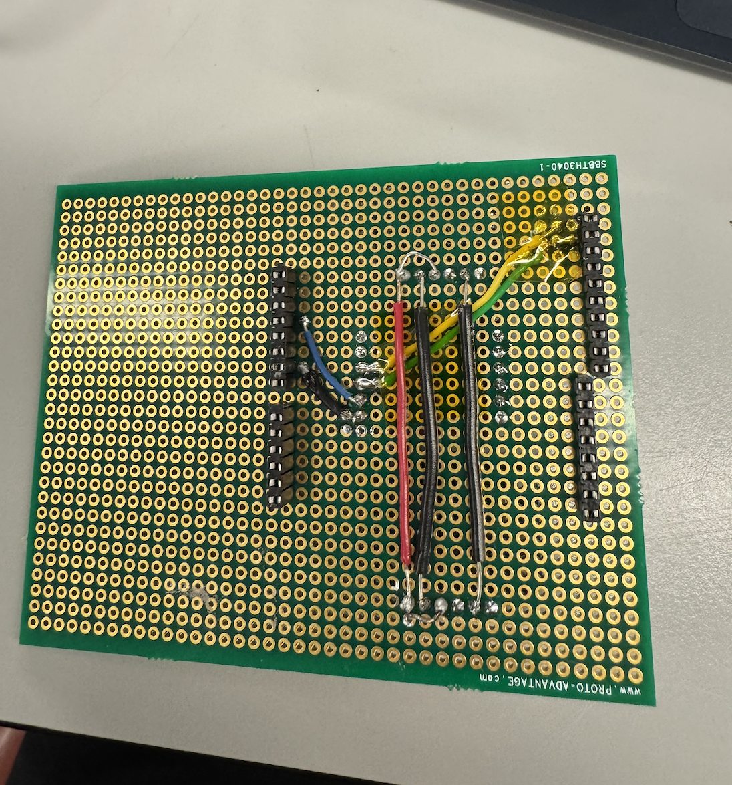

# final-project-skeleton

* Team Number: 8
* Team Name: cod
* Team Members: Cynthia Yang, Dylan Li, Oscar Qu
* GitHub Repository URL: https://github.com/upenn-embedded/final-project-s25-cod.git
* GitHub Pages Website URL: https://github.com/upenn-embedded/final-project-s25-cod

## Final Project Proposal

### 1. Abstract

*In a few sentences, describe your final project.*

Our final project is a self-balancing two-wheeled robot designed to function as an inverted pendulum. Using sensors like an IMU and a PID control algorithm, the robot continuously adjusts its position to stay upright. The project combines embedded systems, control theory, and real-time programming, and explores how stabilization technologies can be applied in areas like robotics, mobility, and accessibility.

### 2. Motivation

*What is the problem that you are trying to solve? Why is this project interesting? What is the intended purpose?*

Our project aims to design and build a self-balancing two-wheeled robot that functions as an inverted pendulum system. The core challenge lies in stabilizing a naturally unstable system using real-time feedback and control. This problem is a classic example in control theory and also has many practical applications in technologies such as personal mobility devices, autonomous robots, and camera stabilization platforms.

What makes this project particularly interesting is the opportunity to apply theoretical concepts—such as PID control, sensor fusion, and real-time processing—to a dynamic, physical system. In addition to the technical learning experience, the project highlights the importance of stabilization systems in increasing accessibility. For example, self-balancing mechanisms are used in assistive devices that help individuals with limited mobility safely navigate various environments. The intended purpose of our project is to gain hands-on experience with embedded systems while exploring how intelligent control and stabilization can be used to improve technology and help others.

### 3. System Block Diagram

*Show your high level design, as done in WS1 and WS2. What are the critical components in your system? How do they communicate (I2C?, interrupts, ADC, etc.)? What power regulation do you need?*

### 4. Design Sketches

*What will your project look like? Do you have any critical design features? Will you need any special manufacturing techniques to achieve your vision, like power tools, laser cutting, or 3D printing?*

We want to laser cut some pieces to enclose the boards and circuitry. For our circuitry, we'll have a couple of perf boards stacked on top of each other with spacers separating them. Other than that, we won't need any special manufacturing techniques.

### 5. Software Requirements Specification (SRS)

*Formulate key software requirements here. Think deeply on the design: What must your device do? How will you measure this during validation testing? Create 4 to 8 critical system requirements.*

*These must be testable! See the Final Project Manual Appendix for details. Refer to the table below; replace these examples with your own.*

**5.1 Definitions, Abbreviations**

Here, you will define any special terms, acronyms, or abbreviations you plan to use for software

**5.2 Functionality**

| ID     | Description |
| ------ | ----------- |
| SRS-01 |             |
| SRS-02 |             |
| SRS-03 |             |
| SRS-04 |             |

### 6. Hardware Requirements Specification (HRS)

*Formulate key hardware requirements here. Think deeply on the design: What must your device do? How will you measure this during validation testing? Create 4 to 8 critical system requirements.*

*These must be testable! See the Final Project Manual Appendix for details. Refer to the table below; replace these examples with your own.*

**6.1 Definitions, Abbreviations**

Here, you will define any special terms, acronyms, or abbreviations you plan to use for hardware

**6.2 Functionality**

| ID     | Description                                                                                                                        |
| ------ | ---------------------------------------------------------------------------------------------------------------------------------- |
| HRS-01 | A distance sensor shall be used for obstacle detection. The sensor shall detect obstacles at a maximum distance of at least 10 cm. |
| HRS-02 | A noisemaker shall be inside the trap with a strength of at least 55 dB.                                                           |
| HRS-03 | An electronic motor shall be used to reset the trap remotely and have a torque of 40 Nm in order to reset the trap mechanism.      |
| HRS-04 | A camera sensor shall be used to capture images of the trap interior. The resolution shall be at least 480p.                       |

### 7. Bill of Materials (BOM)

*What major components do you need and why? Try to be as specific as possible. Your Hardware & Software Requirements Specifications should inform your component choices.*

*In addition to this written response, copy the Final Project BOM Google Sheet and fill it out with your critical components (think: processors, sensors, actuators). Include the link to your BOM in this section.*

### 8. Final Demo Goals

*How will you demonstrate your device on demo day? Will it be strapped to a person, mounted on a bicycle, require outdoor space? Think of any physical, temporal, and other constraints that could affect your planning.*

We plan to demonstrate our self-balancing robot on a tabletop or smooth indoor surface, but we’ll also design it to and potentially show how it handles some mild variations in terrain—such as small ramps, uneven tiles, or bumps—to show its ability to adapt beyond perfectly flat ground. The robot will operate independently (not strapped to a person or mounted on anything) and will be powered by an onboard battery. To further test its balance and stability, we’ll place different objects on top of it to simulate shifting loads, and give it slight pushes to see how well it recovers from disturbances. For safety and control, we’ll test within a defined area to prevent it from rolling off edges. Since our design is compact and doesn’t require outdoor space, we don’t anticipate any major spatial constraints, but we will allow time before the demo to fine-tune our balance control and terrain-handling parameters.

### 9. Sprint Planning

*You've got limited time to get this project done! How will you plan your sprint milestones? How will you distribute the work within your team? Review the schedule in the final project manual for exact dates.*

| Milestone  | Functionality Achieved                                                                                                                                                                               | Distribution of Work                                                                                     |
| ---------- | ---------------------------------------------------------------------------------------------------------------------------------------------------------------------------------------------------- | -------------------------------------------------------------------------------------------------------- |
| Sprint #1  | - CAD complete - Parts (mostly) arrived - Solid understanding of all sensors, devices                                                                                                    | CAD: Cynthia, Dylan Parts Research: All                                                             |
| Sprint #2  | - Mechanical elements machined and ready to assemble - All sensors working independently with some logic implemented                                                                            | Machining: Oscar Sensor Work: 1-2 per member (independent)                                          |
| MVP Demo   | - Final structure fully assembled - Demonstration of driving to some extent                                                                                                                    | Assembly: Cynthia                                                                                        |
| Final Demo | - Demonstration of driving with balancing (sensor values tuned) - Obstacle detection implemented - Ability to drive on non-flat surface implemented - Wiring on perf boards completed | At this point, we'll work together collectively and tie up loose ends/debug the final product. |

**This is the end of the Project Proposal section. The remaining sections will be filled out based on the milestone schedule.**

## Sprint Review #1

### Last week's progress/Current state of project

Last week, we discussed and made changes to our parts list based on different mechanical and electrical. We ordered all of our parts, and some of them have arrived. Currently, we have the IMU, the battery/battery holder/charger, the boost converter modules, and the motor driver. Headers were soldered to our components where necessary.

We've been trying to get I2C working/read measurements from the IMU; we've written I2C functions but haven't gotten them fully working, and we are in the process of debugging. Code has been pushed to repo (IMU.c). Our main goal right now is to get this working. We've tested the battery with the boost converter modules and have successfully used them to power the ATMega, as well as the motor driver and motors. Since our motors haven't arrived, we instead used the 5V DC motors available in Detkin. We've successfully written code that allows us to control the direction/speed of both motors so that we can quickly/easily get everything working once our actual parts arrive. The code is in our repo (motor_test.c).

https://drive.google.com/file/d/1DAIQHN51U2KRT4EcmfAQaR75gM1CxgT3/view?usp=drivesdk

### Next week's plan

Resolve I2C issues and be able to read measurements from IMU.

Once the motors/brackets and wheels arrive, assemble them and try powering them with the battery and boost converter modules. Then, finalize wiring layout amd solder parts on.

Start working on PID control theory and code while other progress is being made.

## Sprint Review #2

### Last week's progress

Last week, we were able test all of our components on the bench, including the boost converter and motor driver. We were able to use the battery to power the boost converter and power all our peripherals, including the motor drivers and ATMega itself. We setup a joystick for bench testing the motor write code that we wrote to be able to manually control the motors, and we were able to figure out how to control the motor speed and direction from doing this. We were also working on getting the i2c implementation working so that we could communicate with the IMU.

### Current state of project

This week, we worked on assembling the project and soldering our components onto the perf boards as they will be for the final project. We were able to get the 2 boost converters and IMU soldered on. We also added headers on the back for where the ATMega will go, and made the connections for the 4 IMU pins. We were also able to get the i2c with the IMU working and reading live gyroscope and accelerometer data, which is demonstrated and explained in the video below. We also integrated the IMU code with the motor write function and setup the PID control loop in the software. We also found motors and wheels in Detkin which we will test and use for the final project, since our digikey order was delayed. 

https://drive.google.com/file/d/1rzPbjwEgyIbL_z1C5IFgU66bXO9Zooof/view?usp=sharing

### Next week's plan

Next week, we will work on integrating all of the components. This includes using the IMU data to send controls to our motor and request different speeds based off of the positioning and movement of the IMU. We ordered motor brackets, and once those come we will have all the components needed to finalize assembly of our project. We will also work on soldering connections to the motor controller, battery, and motors themselves. 

## MVP Demo

1. Show a system block diagram & explain the hardware implementation.
2. Explain your firmware implementation, including application logic and critical drivers you've written.
3. Demo your device.
4. Have you achieved some or all of your Software Requirements Specification (SRS)?

   1. Show how you collected data and the outcomes.
5. Have you achieved some or all of your Hardware Requirements Specification (HRS)?

   1. Show how you collected data and the outcomes.
6. Show off the remaining elements that will make your project whole: mechanical casework, supporting graphical user interface (GUI), web portal, etc.
7. What is the riskiest part remaining of your project?

   1. How do you plan to de-risk this?
8. What questions or help do you need from the teaching team?

## Final Project Report

Don't forget to make the GitHub pages public website!
If you’ve never made a GitHub pages website before, you can follow this webpage (though, substitute your final project repository for the GitHub username one in the quickstart guide):  [https://docs.github.com/en/pages/quickstart](https://docs.github.com/en/pages/quickstart)

### 1. Video

[Insert final project video here]

* The video must demonstrate your key functionality.
* The video must be 5 minutes or less.
* Ensure your video link is accessible to the teaching team. Unlisted YouTube videos or Google Drive uploads with SEAS account access work well.
* Points will be removed if the audio quality is poor - say, if you filmed your video in a noisy electrical engineering lab.

### 2. Images

[Insert final project images here]

*Include photos of your device from a few angles. If you have a casework, show both the exterior and interior (where the good EE bits are!).*

### 3. Results

*What were your results? Namely, what was the final solution/design to your problem?*

#### 3.1 Software Requirements Specification (SRS) Results

*Based on your quantified system performance, comment on how you achieved or fell short of your expected requirements.*

*Did your requirements change? If so, why? Failing to meet a requirement is acceptable; understanding the reason why is critical!*

*Validate at least two requirements, showing how you tested and your proof of work (videos, images, logic analyzer/oscilloscope captures, etc.).*

| ID     | Description                                                                                               | Validation Outcome                                                                          |
| ------ | --------------------------------------------------------------------------------------------------------- | ------------------------------------------------------------------------------------------- |
| SRS-01 | The IMU 3-axis acceleration will be measured with 16-bit depth every 100 milliseconds +/-10 milliseconds. | Confirmed, logged output from the MCU is saved to "validation" folder in GitHub repository. |

#### 3.2 Hardware Requirements Specification (HRS) Results

*Based on your quantified system performance, comment on how you achieved or fell short of your expected requirements.*

*Did your requirements change? If so, why? Failing to meet a requirement is acceptable; understanding the reason why is critical!*

*Validate at least two requirements, showing how you tested and your proof of work (videos, images, logic analyzer/oscilloscope captures, etc.).*

| ID     | Description                                                                                                                        | Validation Outcome                                                                                                      |
| ------ | ---------------------------------------------------------------------------------------------------------------------------------- | ----------------------------------------------------------------------------------------------------------------------- |
| HRS-01 | A distance sensor shall be used for obstacle detection. The sensor shall detect obstacles at a maximum distance of at least 10 cm. | Confirmed, sensed obstacles up to 15cm. Video in "validation" folder, shows tape measure and logged output to terminal. |
|        |                                                                                                                                    |                                                                                                                         |

### 4. Conclusion

Reflect on your project. Some questions to address:

* What did you learn from it?
* What went well?
* What accomplishments are you proud of?
* What did you learn/gain from this experience?
* Did you have to change your approach?
* What could have been done differently?
* Did you encounter obstacles that you didn’t anticipate?
* What could be a next step for this project?

## References

Fill in your references here as you work on your final project. Describe any libraries used here.
