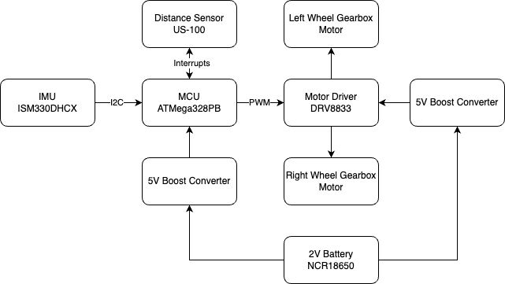

# final-project-skeleton

* Team Number: 8
* Team Name: cod
* Team Members: Cynthia Yang, Dylan Li, Oscar Qu
* GitHub Repository URL: https://github.com/upenn-embedded/final-project-s25-cod.git
* GitHub Pages Website URL: https://github.com/upenn-embedded/final-project-s25-cod

## Final Project Proposal

### 1. Abstract

*In a few sentences, describe your final project.*

Our final project is a self-balancing two-wheeled robot designed to function as an inverted pendulum. Using sensors like an IMU and a PID control algorithm, the robot continuously adjusts its position to stay upright. The project combines embedded systems, control theory, and real-time programming, and explores how stabilization technologies can be applied in areas like robotics, mobility, and accessibility.

### 2. Motivation

*What is the problem that you are trying to solve? Why is this project interesting? What is the intended purpose?*

Our project aims to design and build a self-balancing two-wheeled robot that functions as an inverted pendulum system. The core challenge lies in stabilizing a naturally unstable system using real-time feedback and control. This problem is a classic example in control theory and also has many practical applications in technologies such as personal mobility devices, autonomous robots, and camera stabilization platforms.

What makes this project particularly interesting is the opportunity to apply theoretical concepts—such as PID control, sensor fusion, and real-time processing—to a dynamic, physical system. In addition to the technical learning experience, the project highlights the importance of stabilization systems in increasing accessibility. For example, self-balancing mechanisms are used in assistive devices that help individuals with limited mobility safely navigate various environments. The intended purpose of our project is to gain hands-on experience with embedded systems while exploring how intelligent control and stabilization can be used to improve technology and help others.

### 3. System Block Diagram

*Show your high level design, as done in WS1 and WS2. What are the critical components in your system? How do they communicate (I2C?, interrupts, ADC, etc.)? What power regulation do you need?*

### 4. Design Sketches

*What will your project look like? Do you have any critical design features? Will you need any special manufacturing techniques to achieve your vision, like power tools, laser cutting, or 3D printing?*

We want to laser cut some pieces to enclose the boards and circuitry. For our circuitry, we'll have a couple of perf boards stacked on top of each other with spacers separating them. Other than that, we won't need any special manufacturing techniques.

### 5. Software Requirements Specification (SRS)

*Formulate key software requirements here. Think deeply on the design: What must your device do? How will you measure this during validation testing? Create 4 to 8 critical system requirements.*

*These must be testable! See the Final Project Manual Appendix for details. Refer to the table below; replace these examples with your own.*

**5.1 Definitions, Abbreviations**

Here, you will define any special terms, acronyms, or abbreviations you plan to use for software

**5.2 Functionality**

| ID     | Description                                                                                                                                                                                                                                                                                                                                                                                                                            |
| ------ | -------------------------------------------------------------------------------------------------------------------------------------------------------------------------------------------------------------------------------------------------------------------------------------------------------------------------------------------------------------------------------------------------------------------------------------- |
| SRS-01 | The IMU should be able to read the gyroscope and accelerometer data, and as a peripheral, send the information via I2C to the MCU. This functionality can be tested using the logic analyzer, as the IMU I2C data can be probed using a breadboard. We can also verify that the MCU is able to read and use the data by writing to a serial monitor using the MCU, and seeing that the data is correct and accurate.                   |
| SRS-02 | We are using a PID control algorithm to keep our robot stable. This will be harder to test until the final robot is assembled, but we can do some functionality testing by inputting values to our algorithm and seeing how the feedback loop responds.                                                                                                                                                                                |
| SRS-03 | The motor controller can be tested because it will be outputting a PWM signal to control the DC motors. We can test this functionality by configuring to write different speeds or control signals to the DC motor and seeing how it responds. We can also test that the motor controller receives the right signal by probing it from the MCU output.                                                                                 |
| SRS-04 | Timers, feedback, interrupts: we will be configuring a pid control loop which will require a lot of accurate timing, calculations, and measurements, so it will be necessary to make sure that the data being stored isn't lost and we are using the proper timers to allow our robot to function properly. This will ultimately be tested to see if our feedback loop is able to spin the wheels properlya ccording to the IMU input. |

### 6. Hardware Requirements Specification (HRS)

*Formulate key hardware requirements here. Think deeply on the design: What must your device do? How will you measure this during validation testing? Create 4 to 8 critical system requirements.*

*These must be testable! See the Final Project Manual Appendix for details. Refer to the table below; replace these examples with your own.*

**6.1 Definitions, Abbreviations**

MCU - microcontroller unit

IMU - inertial measurement unit

**6.2 Functionality**

| ID     | Description                                                                                                                                                                                                                                                                                                                                                                                                               |
| ------ | ------------------------------------------------------------------------------------------------------------------------------------------------------------------------------------------------------------------------------------------------------------------------------------------------------------------------------------------------------------------------------------------------------------------------- |
| HRS-01 | The MCU should be able to accurately read inputs and send proper outputs in the right time frame. The inputs involve measurements from our IMU, and the outputs involve interfacing with our motor driver. Given these inputs and outputs, the MCU has to process everything quickly enough to keep the robot upright. The final way to test this functionality will be when all components are assembled with the robot. |
| HRS-02 | The IMU shall provide accurate accelerometer and gyroscope data. This can be measured during testing by connecting the IMU to the MCU, moving the sensor around and seeing if the right measurements are being read and that they are also being received by the MCU.                                                                                                                                                     |
| HRS-03 | The motor driver shall be able to properly receive input signals from the MCU and send the right amount of torque to the motors. If done incorrectly, the robot will not be able to self-balance. This can be tested in conjunction with the MCU, motor driver, and motors to see if the MCU is able to control the motor speed through the driver.                                                                       |
| HRS-04 | The motors shall be able to accurately and precisely respond to input and output the right amount of torque or move the robot forwards and backwards the right amount. This can be tested off the bench by testing if the motor driver can drive the motors under different conditions, and using it to tune our code.7. Bill of Materials (BOM)                                                                          |
| HRS-05 | The boost converter will be used to step up the battery voltage to 5V which will be used to power the other components which require 5V of input power. This can be tested on the bench by inputting the battery voltage using the power supply and measuring the output of the boost converter.                                                                                                                          |

*What major components do you need and why? Try to be as specific as possible. Your Hardware & Software Requirements Specifications should inform your component choices.*

*In addition to this written response, copy the Final Project BOM Google Sheet and fill it out with your critical components (think: processors, sensors, actuators). Include the link to your BOM in this section.*

For power management, we need a battery and 5V boost converters to power the onboaard equipment. For inputs, we need a distance sensor and a 6-axis IMU. For outputs, we need a motor driver and two motors. The parts we chose are listed in the BOM below.

https://docs.google.com/spreadsheets/d/1Y-K9_Fi_6sH_B7sAxI0wECFs5X0Qdpfmlkchg_VZfHY/edit?usp=sharing

### 8. Final Demo Goals

*How will you demonstrate your device on demo day? Will it be strapped to a person, mounted on a bicycle, require outdoor space? Think of any physical, temporal, and other constraints that could affect your planning.*

We plan to demonstrate our self-balancing robot on a tabletop or smooth indoor surface, but we’ll also design it to and potentially show how it handles some mild variations in terrain—such as small ramps, uneven tiles, or bumps—to show its ability to adapt beyond perfectly flat ground. The robot will operate independently (not strapped to a person or mounted on anything) and will be powered by an onboard battery. To further test its balance and stability, we’ll place different objects on top of it to simulate shifting loads, and give it slight pushes to see how well it recovers from disturbances. For safety and control, we’ll test within a defined area to prevent it from rolling off edges. Since our design is compact and doesn’t require outdoor space, we don’t anticipate any major spatial constraints, but we will allow time before the demo to fine-tune our balance control and terrain-handling parameters.

### 9. Sprint Planning

*You've got limited time to get this project done! How will you plan your sprint milestones? How will you distribute the work within your team? Review the schedule in the final project manual for exact dates.*

| Milestone  | Functionality Achieved                                                                                                                                                                               | Distribution of Work                                                                                     |
| ---------- | ---------------------------------------------------------------------------------------------------------------------------------------------------------------------------------------------------- | -------------------------------------------------------------------------------------------------------- |
| Sprint #1  | - CAD complete - Parts (mostly) arrived - Solid understanding of all sensors, devices                                                                                                    | CAD: Cynthia, Dylan Parts Research: All                                                             |
| Sprint #2  | - Mechanical elements machined and ready to assemble - All sensors working independently with some logic implemented                                                                            | Machining: Oscar Sensor Work: 1-2 per member (independent)                                          |
| MVP Demo   | - Final structure fully assembled - Demonstration of driving to some extent                                                                                                                    | Assembly: Cynthia                                                                                        |
| Final Demo | - Demonstration of driving with balancing (sensor values tuned) - Obstacle detection implemented - Ability to drive on non-flat surface implemented - Wiring on perf boards completed | At this point, we'll work together collectively and tie up loose ends/debug the final product. |

**This is the end of the Project Proposal section. The remaining sections will be filled out based on the milestone schedule.**

## Sprint Review #1

### Last week's progress

### Current state of project

### Next week's plan

## Sprint Review #2

### Last week's progress

### Current state of project

### Next week's plan

## MVP Demo

1. Show a system block diagram & explain the hardware implementation.
2. Explain your firmware implementation, including application logic and critical drivers you've written.
3. Demo your device.
4. Have you achieved some or all of your Software Requirements Specification (SRS)?

   1. Show how you collected data and the outcomes.
5. Have you achieved some or all of your Hardware Requirements Specification (HRS)?

   1. Show how you collected data and the outcomes.
6. Show off the remaining elements that will make your project whole: mechanical casework, supporting graphical user interface (GUI), web portal, etc.
7. What is the riskiest part remaining of your project?

   1. How do you plan to de-risk this?
8. What questions or help do you need from the teaching team?

## Final Project Report

Don't forget to make the GitHub pages public website!
If you’ve never made a GitHub pages website before, you can follow this webpage (though, substitute your final project repository for the GitHub username one in the quickstart guide):  [https://docs.github.com/en/pages/quickstart](https://docs.github.com/en/pages/quickstart)

### 1. Video

[Insert final project video here]

* The video must demonstrate your key functionality.
* The video must be 5 minutes or less.
* Ensure your video link is accessible to the teaching team. Unlisted YouTube videos or Google Drive uploads with SEAS account access work well.
* Points will be removed if the audio quality is poor - say, if you filmed your video in a noisy electrical engineering lab.

### 2. Images

[Insert final project images here]

*Include photos of your device from a few angles. If you have a casework, show both the exterior and interior (where the good EE bits are!).*

### 3. Results

*What were your results? Namely, what was the final solution/design to your problem?*

#### 3.1 Software Requirements Specification (SRS) Results

*Based on your quantified system performance, comment on how you achieved or fell short of your expected requirements.*

*Did your requirements change? If so, why? Failing to meet a requirement is acceptable; understanding the reason why is critical!*

*Validate at least two requirements, showing how you tested and your proof of work (videos, images, logic analyzer/oscilloscope captures, etc.).*

| ID     | Description                                                                                               | Validation Outcome                                                                          |
| ------ | --------------------------------------------------------------------------------------------------------- | ------------------------------------------------------------------------------------------- |
| SRS-01 | The IMU 3-axis acceleration will be measured with 16-bit depth every 100 milliseconds +/-10 milliseconds. | Confirmed, logged output from the MCU is saved to "validation" folder in GitHub repository. |

#### 3.2 Hardware Requirements Specification (HRS) Results

*Based on your quantified system performance, comment on how you achieved or fell short of your expected requirements.*

*Did your requirements change? If so, why? Failing to meet a requirement is acceptable; understanding the reason why is critical!*

*Validate at least two requirements, showing how you tested and your proof of work (videos, images, logic analyzer/oscilloscope captures, etc.).*

| ID     | Description                                                                                                                        | Validation Outcome                                                                                                      |
| ------ | ---------------------------------------------------------------------------------------------------------------------------------- | ----------------------------------------------------------------------------------------------------------------------- |
| HRS-01 | A distance sensor shall be used for obstacle detection. The sensor shall detect obstacles at a maximum distance of at least 10 cm. | Confirmed, sensed obstacles up to 15cm. Video in "validation" folder, shows tape measure and logged output to terminal. |
|        |                                                                                                                                    |                                                                                                                         |

### 4. Conclusion

Reflect on your project. Some questions to address:

* What did you learn from it?
* What went well?
* What accomplishments are you proud of?
* What did you learn/gain from this experience?
* Did you have to change your approach?
* What could have been done differently?
* Did you encounter obstacles that you didn’t anticipate?
* What could be a next step for this project?

## References

Fill in your references here as you work on your final project. Describe any libraries used here.
